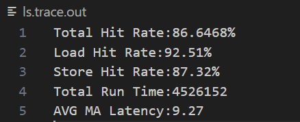
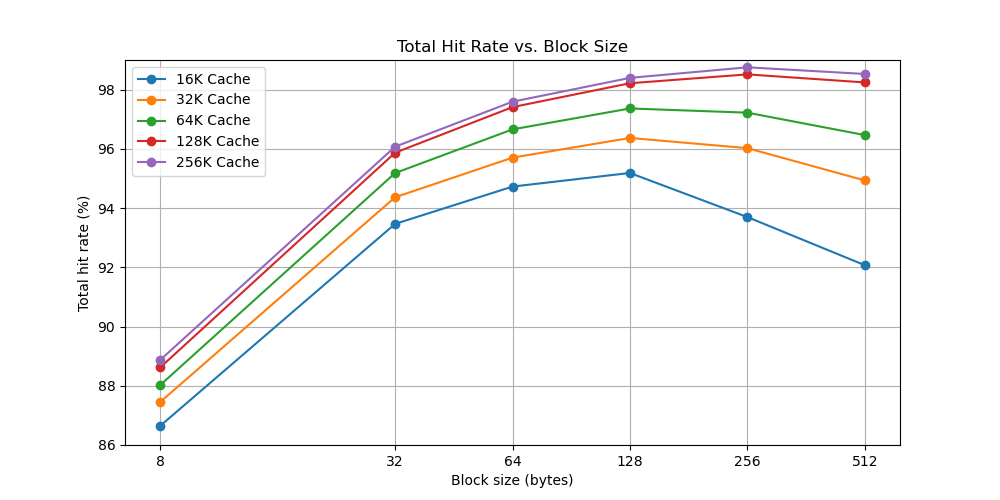
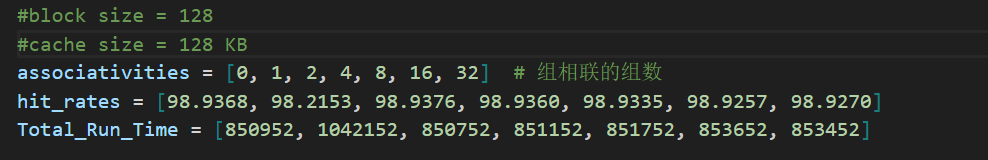
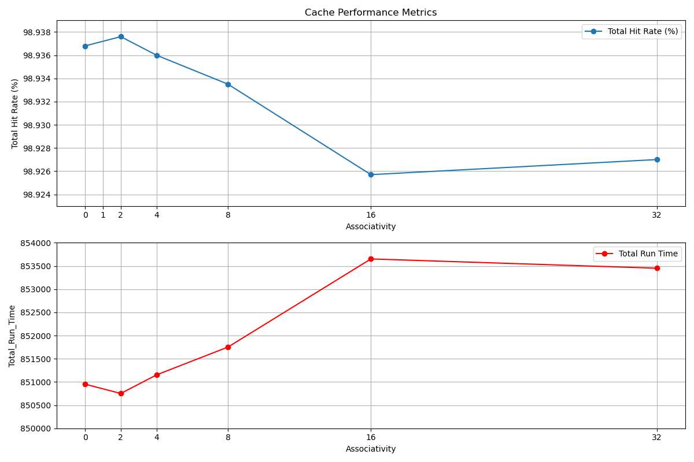
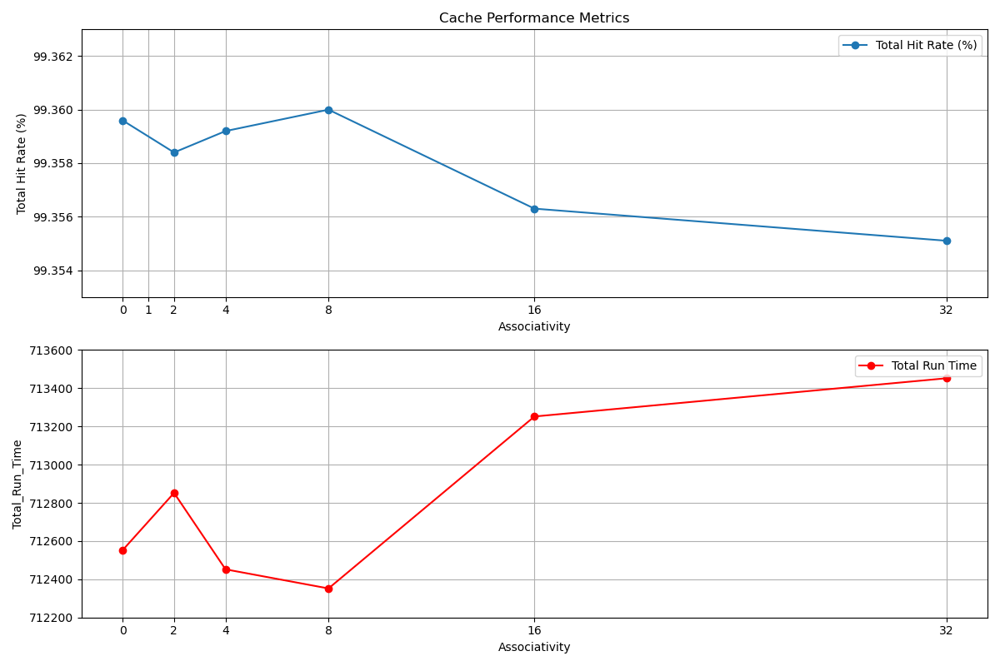

# 实验4：cache模拟器


## 1 实验目的

完成cache模拟器；理解cache块大小对cache性能的影响； 理解cache关联性对cache性能的影响； 理解cache总大小对cache性能的影响； 理解cache替换策略对cache性能的影响； 理解cache写回策略对cache性能的影响。


## 2 实验内容

读取配置文件，按配置文件实现cache模拟器。对给出的跟踪文件进行回放，计算并输出cache模拟器的性能参数。

### 2.1 数据接口

**cache设计：**

- **`S`：**组相联的组数。S = 2^s^，**`s`** 为组索引的位数。

- **`E`：**每组的行数。
- **`B`：**块大小，以字节为单位。B = 2^b^，**`b`**为块内偏移的位数。
- 二维数组 `Cacheline_with_dirty **lines` ： 考虑到写回策略，cache中每一行 lines 应当存1位dirty位（1代表数据已被修改），1位valid位（1代表是从内存中读取的有效数据），tag位，TimeStamp（时间戳，为了后续LRU替换策略）。

cache 分为 `i-cache` 和 `d-cache`，分别用于存储指令和数据。指令存储器 `i-cache` 不需要写回，只需要读取；数据存储器 `d-cache` 需要写回。


### 2.2 主要函数

- **void read_config(char *file_path, char *trace_file)：**读入config file。根据 S 的取值，对应直接映射（S=1）、全相联（S=0）、组相联（S = 2^s^）。初始化cache、monitor cache。

- **void init_cache(int S, int E, int B)：**初始化cache

- LRU替换策略维护cache：

  - **int IsFull(int op_s, Cache *mycache)：**判断组号为 op_s 的组是否全满，满则返回 -1，未满则返回 op_s 组中空的行号 
  - **int find_max_LRU(int op_s, Cache *mycache)：**当IsFull返回 -1 时，找到 op_s 组中最近最久未访问的行号，即将替换出去

  - **void update(int i, int op_s, int op_tag, Cache *mycache)：**以组为单位进行 LRU 时间戳更新。具体方法为：遍历每一行，组中每个时间戳都会变大，表示它离最后操作的时间变久；将本次操作的行时间戳设置为最小，也就是0

  - **LRU_update_R_d：**load/store时，先根据 op_s 定位到组 op_s，遍历，看是否找到 tag 匹配的行。找到为 hit；未找到为 miss，同时采用LRU策略替换，注意应先写回被修改过的数据（dirty = 1）。最后更新组 op_s 的时间戳，便于维护 cache。

    （为了计数方便，写了三个函数 LRU_update_R_d，LRU_update_R_i，LRU_update_W，结构是一样的，以下展示 LRU_update_R_d，其余在源代码中）

```c
void LRU_update_R_d(int op_s, int op_tag, Cache *mycache) // 对于load指令
{                                                         // 缓存搜索及更新
    int index_get = -1;
    int i;
    for (i = 0; i < mycache->E; i++){
        if (mycache->lines[op_s][i].valid && mycache->lines[op_s][i].tag == op_tag){
            index_get = i;
            break;
        }
    }
    if (index_get == -1)
    { // miss
        int k = IsFull(op_s, mycache);
        if (k == -1){
            k = find_max_LRU(op_s, mycache);
            if (mycache->lines[op_s][k].dirty == 1)
                write_back(op_s, k, mycache);
        }
        update(k, op_s, op_tag, mycache);
    }
    else{ // hit
        d_hit_r++;
        update(index_get, op_s, op_tag, mycache);
    }
}
```

- **void monitor(char *trace_file, int s, int E, int b)：**根据 trace file 的每行指令，进行对应的操作。拿到地址后先截取出 tag 部分、组索引部分。

  **全相联时，**单独写了 **monitor_for_S_0** 函数，结构与 monitor 函数相似。区别在于全相联时可以看作只有一个组，所有行都在这个组中，**没有组索引位了**，只需要从地址中取出 op_tag 和 i_op_tag。另外调用 LRU_update 时， op_s = 0。

  ```c
  while (fscanf(pFile, "%llx: %c %llx", &i_address, &identifier, &data_addr) > 0){
      int op_tag = data_addr >> (s + b);
      int op_s = (data_addr >> b) & ((unsigned)(-1) >> (8 * sizeof(unsigned) - s)); 
      int i_op_tag = i_address >> (s + b);
      int i_op_s = (i_address >> b) & ((unsigned)(-1) >> (8 * sizeof(unsigned) - s));
      switch (identifier){
          case 'R':
              {
                  LRU_update_R_d(op_s, op_tag, d_cache);
                  LRU_update_R_i(i_op_s, i_op_tag, i_cache);
                  lines_cnt++;       // 总共多少条指令
                  R_cnt = R_cnt + 2; // 总共多少load指令
                  break;
              }
          case 'W':
              {
                  LRU_update_W(op_s, op_tag, d_cache);
                  LRU_update_R_i(i_op_s, i_op_tag, i_cache);
                  lines_cnt++;
                  W_cnt++; // 总共多少store指令
                  R_cnt++;
                  break;
              }
      }
  }
  ```

- **void free_cache()：**最后释放cache的空间


### 2.3 计算性能

- 总命中率 `hit_total`：命中的内存操作(即跟踪文件中的行)的百分比，其数字应保留小数点后4位。这通常指的是**数据缓存 `d-cache` 的命中**而不是指令缓存 `i-cache`，所以 `hit_total = (d_hit_r + d_hit_w) / lines_cnt × 100%`
- load命中率 `hit_load`：命中的load百分比，其数字应保留小数点后2位。“命中”**包括指令命中和数据命中**，所以 `hit_load = (d_hit_r + i_hit) / R_cnt × 100%`
- store命中率 `hit_store`：命中的store百分比，其数字应保留小数点后2位。store 仅为 'W' 指令时，因此 `hit_store = d_hit_w / W_cnt × 100%`
- 总运行时间：程序的总运行时间，单位为周期数。miss 时会产生**额外**开销，故 hit 时的周期是1，**miss 时的周期为（1+miss_cost）**，所以 ` runtime_total = (R_cnt + W_cnt) + (R_cnt + W_cnt - (d_hit_r + d_hit_w + i_hit)) × miss_cost `
- 平均内存访问延迟：完成内存访问所需的平均周期数，其数字应保留小数点后2位。`avg_latency = runtime_total / (R_cnt + W_cnt)`

（其中，`R_cnt` 代表 load 进 `d-cache` 或 `i-cache` 的次数，`W_cnt` 代表store 进 `d-cache` 的次数。`lines_cnt` 是指令的条数，有关系 `lines_cnt × 2 = R_cnt + W_cnt`，因为每条指令都对 `i-cache` 和 `d-cache` 各有一次操作。）


### 2.4 实验结果

配置文件：8 1 16 1 100 1

输出：



（更多输出结果请见 results_blocksize.txt 文件）


## 3 影响cache性能的因素

### 3.1 块大小对cache性能的影响

为了研究不同cache大小情况下，不同cache块大小对命中率的影响，将块大小取8、32、64、128、256字节，cache大小取16KB、32KB、64KB、128KB、256kb，采用直接映射、写分配、LRU替换规则，作图：



由图和输出结果可知，block 大小与 cache 大小有关。**块大小越大，cache 中的行数越少，运行的总时长越短，命中率会提高，这是更好地利用了空间局部性的结果。但对于较小的cache，块大小很大时会导致总命中率降低，**可能是因为此时缓存行数较少，用于存储不同数据的空间也会相应减少；缓存中存储了很多“无用”的数据，而需要的数据可能因为缓存空间不足而被逐出导致缓存命中率下降。因此结论是，cache大小一定时，块大小即不能太大，也不能太小。

根据不同的线可知，**cache大小越大，总命中率越高，**但相应的成本也会增加。


### 3.2 关联性对cache性能的影响

为了研究不同关联性对命中率的影响，固定cache大小情况下，cache大小取128KB，块大小取128KB，关联性选择全相联、直接映射、2路组相联、4路组相联、8路组相联，采用写分配、LRU替换规则。记录输出结果：



可见**直接映射的总运行时间很长，且总命中率最低**，这是因为关联度低，主存的每一块映射到一个固定的cache行，可能导致频繁cache装入。因为直接映射的 total_run_time 太大了，作图时我去掉了直接映射的数据点。

**全相联映射的命中率很大，比组相联cache性能更优，且速度较快。但一些组内行数较少的情况可能会性能优于全相联映射。**因为只要有空闲行，都不会发生冲突。但这个结果显示2路组相联时得到了更高的命中率，尝试了不同的块大小依然会有这种特殊情况，猜测是因为全相联需要遍历所有cache行来比较tag，导致速度变慢；2路组相联缓存每组只有两行，限制了替换算法需要评估的候选行数，可能因此更有效率地管理缓存行。

**较少的组内行数意味着每个组的管理更简单。**这可能使得如LRU等替换策略更有效，因为替换决策涉及的选择较少，减少了替换错误的可能性；且如果工作负载的局部性特别强，即访问集中在较小的数据集上，较少的组内行数可能足以覆盖这些频繁访问的数据，从而提高命中率。较少的组内行数可能意味着更多的缓存组，这也有助于分散数据，减少冲突。另外，较少的组内行数意味着遍历需要的时间更短，使得运行时长较短。


作图比较：

block size = 128 时：



block size = 256 时：



## 4 实验结论

在这次实验中，我实现了cache模拟器，能够理解cache块大小对cache性能的影响， 理解cache关联性对cache性能的影响，理解cache总大小对cache性能的影响，也了解了cache替换策略对cache性能的影响、cache写回策略对cache性能的影响。

通过比较不同cache大小、不同块大小、不同关联性时cache的命中率、总运行时长，得出结论：

- 块大小越大，cache 中的行数越少，运行的总时长越短，命中率会提高，这是更好地利用了空间局部性的结果。但对于较小的cache，块大小很大时会导致总命中率降低。

- cache大小越大，总命中率越高。

- 直接映射的总运行时间很长，且总命中率最低。

  全相联映射的命中率很大，比组相联cache性能更优，且速度较快。但一些组内行数较少的情况可能会性能优于全相联映射。

  较少的组内行数意味着每个组的管理更简单，命中率较高，运行时长较短。


### 附

踩坑：

**全局变量：**全局变量会在程序开始执行时被初始化（在任何函数执行前），初始化一次，且只初始化一次（即使它在程序中被多次引用或在不同的文件中声明（使用 `extern` 关键字））。并且在程序的整个生命周期内保持活跃状态。全局变量在程序的任何部分都是可访问的，前提是它在当前的作用域中是可见的（例如通过头文件的声明或在同一个源文件中）。当全局变量的值在程序的某个部分被修改后，这个新值会立即反映到整个程序中。


让x轴均匀分布，而不是间隔越来越大：

**plt.xscale('log', basex=2)**: 这行代码将 X 轴设置为对数尺度，并且底数为 2。这是因为您的块大小以 2 的幂次增长，使用对数尺度可以使其在视觉上均匀分布。

**plt.xticks(block_sizes, labels=block_sizes)**: 通过这种方式，您可以确保 X 轴上的标记显示为实际的块大小值。


编译运行：

gcc csim.c -o cachesim

 ./cachesim -c cfg.txt -t ls.trace -o ls.trace.out （输出到文件）

./cachesim -c cfg.txt -t ls.trace （输出到终端）

